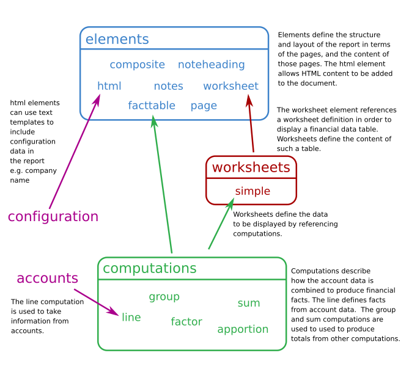

## Information flows

There are various moving parts which result in the production of a report:

- The elements define the structure of a report.  The command-line
  `ixbrl-reporter` is called with the identifier of an element which is
  used as the root of the report.  There are various 'kinds' of element e.g.
  `html`, `composite`, `page` and `worksheet`.  Some elements e.g. `page`
  can invoke other elements recursively.
- The `html` element is used to add HTML content to a report.  Some elements
  can contain text templates which have values taken from the configuration
  which allows configuration data such as the name of the company, or the
  names of the directors to be added to the report.
- The `worksheet` element is used to add account computations in tabular
  form, and would be used to include e.g. a balance sheet.  The `worksheet`
  element references a worksheet definition.
- Worksheets describe the set of computations which are to be laid out in
  a financial table.
- Computations are used to produce financial facts e.g. profit.  Some
  financial facts are taken out of the account data e.g. the total of
  all transactions on one or more income accounts can be totalled to
  produce an income fact.  Some computations can be combined to produce
  other values e.g. profit can be derived by subtracting various expenses
  from the income computation.  Computations can be applied to one or
  more periods so that the same fact can be calculated in different periods.
- The `line` computation is used to create a single fact by totalling
  transactions from one or more accounts in the accounts file.
- The `group` and `sum` computations produce a total by summing a set of
  other computations.  The difference between the two is that `group`
  causes the total to be shown below an itemised breakdown of the input
  computations, whereas `sum` shows only the total on a worksheet.
- Computations are defined in terms of an identifier e.g. `gross-profit`.
  When emitted in reports, the identifer is used to identify any potential
  iXBRL tags to emit in the report from the taxonomy.

See [Configuration](config.md) for a reference of the configuration
structure.

