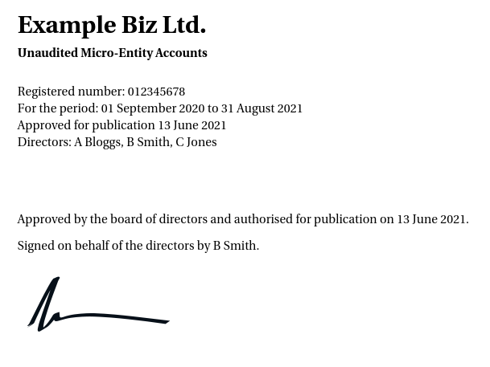
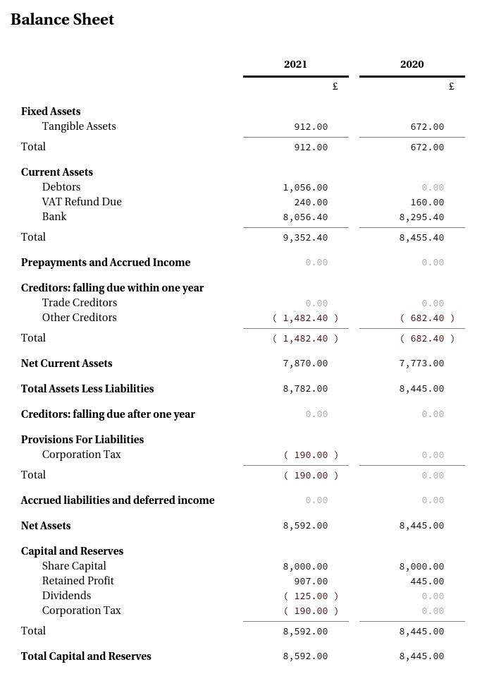
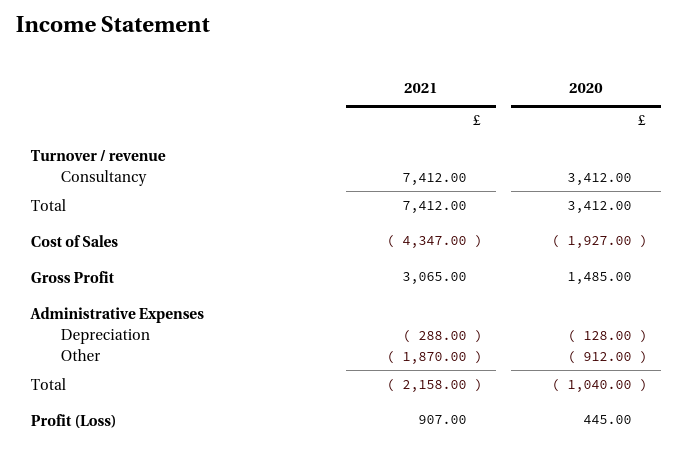
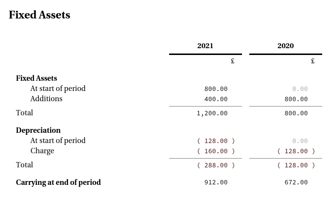
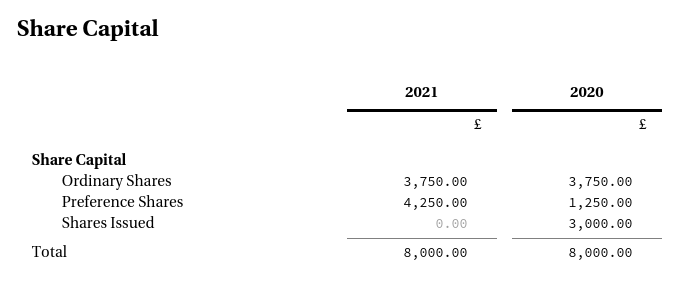
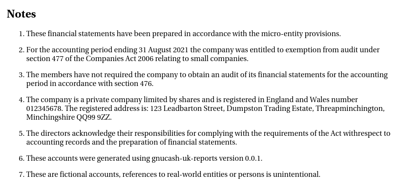
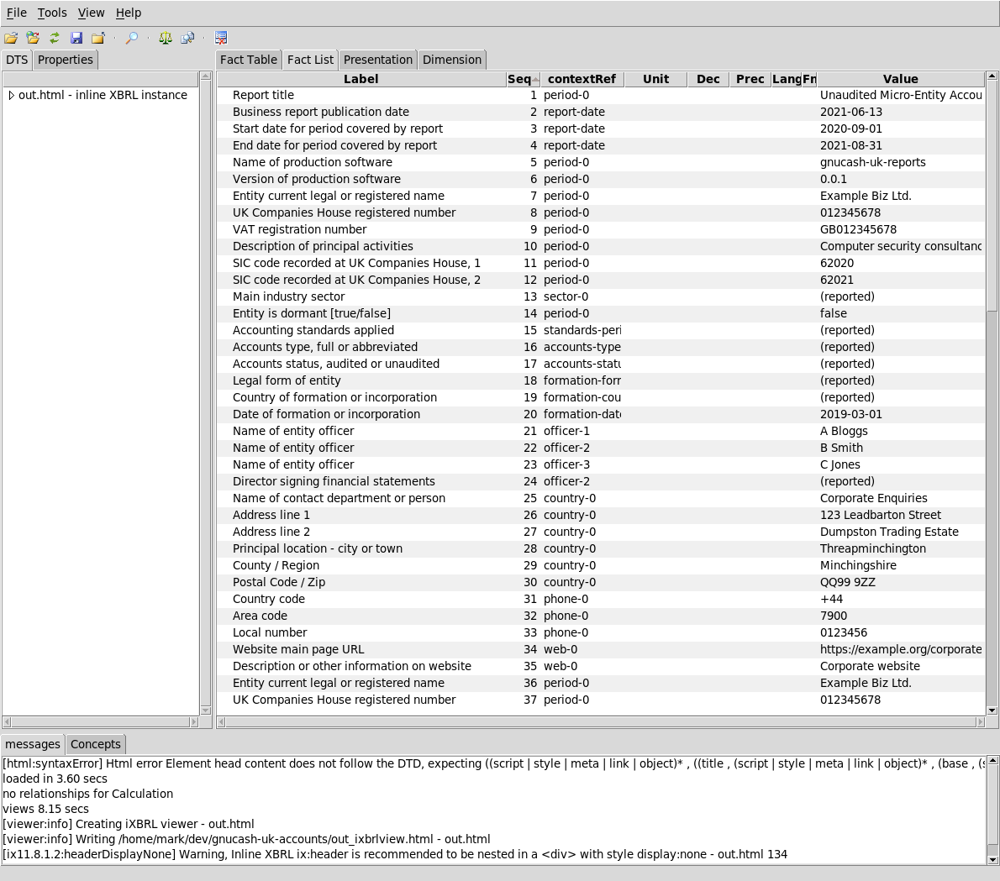
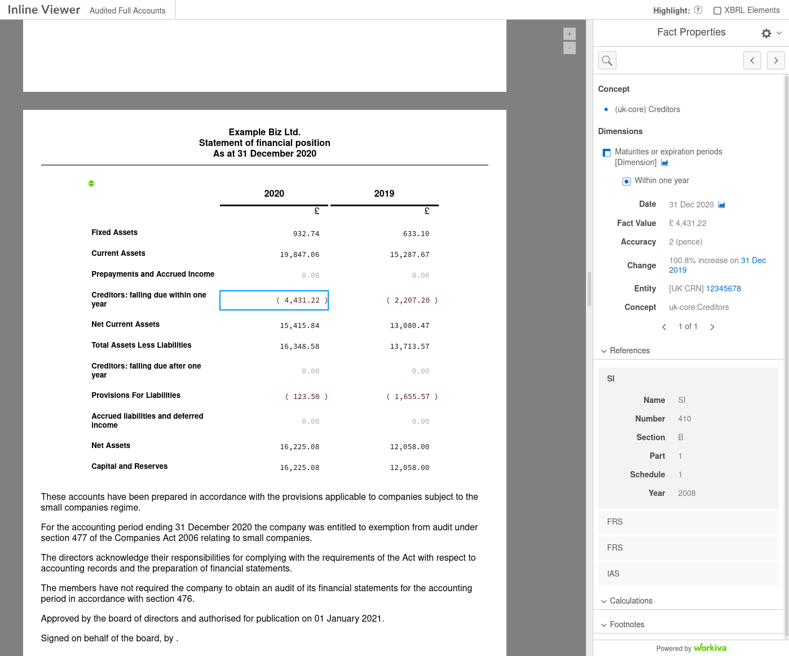

# Some sample output

## Plain text

```
Example Biz Ltd.
Registered number: 012345678
Unaudited Micro-Entity Accounts
For the period: 2020-09-01 - 2021-08-31
Approved for publication 2021-06-13

*** Balance Sheet ***
                                               2021       2020  

Fixed Assets:
  Tangible Assets                       :    912.00     672.00  
Total                                   :    912.00     672.00  

Current Assets:
  Debtors                               :   1056.00          -  
  VAT Refund Due                        :    240.00     160.00  
  Bank                                  :   8056.40    8295.40  
Total                                   :   9352.40    8455.40  

Prepayments and Accrued Income          :         -          -  

Creditors: falling due within one year:
  Trade Creditors                       :         -          -  
  Other Creditors                       :  (1482.40)   (682.40) 
Total                                   :  (1482.40)   (682.40) 

Net Current Assets                      :   7870.00    7773.00  

Total Assets Less Liabilities           :   8782.00    8445.00  

Creditors: falling due after one year   :         -          -  

Provisions For Liabilities:
  Corporation Tax                       :   (190.00)         -  
Total                                   :   (190.00)         -  

Accrued liabilities and deferred income :         -          -  

Net Assets                              :   8592.00    8445.00  

Capital and Reserves:
  Share Capital                         :   8000.00    8000.00  
  Retained Profit                       :    907.00     445.00  
  Dividends                             :   (125.00)         -  
  Corporation Tax                       :   (190.00)         -  
Total                                   :   8592.00    8445.00  

Total Capital and Reserves              :   8592.00    8445.00  


*** Income Statement ***
                                               2021       2020  

Turnover / revenue:
  Consultancy                           :   7412.00    3412.00  
Total                                   :   7412.00    3412.00  

Cost of Sales                           :  (4347.00)  (1927.00) 

Gross Profit                            :   3065.00    1485.00  

Administrative Expenses:
  Depreciation                          :   (288.00)   (128.00) 
  Other                                 :  (1870.00)   (912.00) 
Total                                   :  (2158.00)  (1040.00) 

Profit (Loss)                           :    907.00     445.00  


*** Fixed Assets ***
                                               2021       2020  

Fixed Assets:
  At start of period                    :    800.00          -  
  Additions                             :    400.00     800.00  
Total                                   :   1200.00     800.00  

Depreciation:
  At start of period                    :   (128.00)         -  
  Charge                                :   (160.00)   (128.00) 
Total                                   :   (288.00)   (128.00) 

Carrying at end of period               :    912.00     672.00  


*** Share Capital ***
                                               2021       2020  

Share Capital:
  Ordinary Shares                       :   3750.00    3750.00  
  Preference Shares                     :   4250.00    1250.00  
  Shares Issued                         :         -    3000.00  
Total                                   :   8000.00    8000.00  
```

## iXBRL output (in a browser)













## iXBRL in Arelle

The iXBRL can be loaded into Arelle to allow facts to be viewed.



## iXBRL in ixbrl-viewer

The iXBRL can be loaded into ixbrlviewer.  Easiest way is to do follow the
installation instructions for
[ixbrl-viewer](https://github.com/Workiva/ixbrl-viewer) so that it is
an Arelle plugin.



